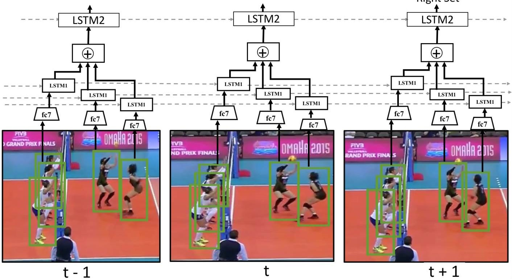

# Enhanced Group Activity Recognition 🏐

[](https://www.python.org/)
[](https://pytorch.org/)
[](LICENSE)
[](https://www.cs.sfu.ca/~mori/research/papers/ibrahim-cvpr16.pdf)
[](https://arxiv.org/pdf/1607.02643)

An enhanced PyTorch implementation of the hierarchical deep temporal framework for **Group Activity Recognition (GAR)** in multi-person video sequences. This project implements multiple baseline architectures and proposes advanced models to recognize collective human activities from video data.

This repository builds upon the foundational work of Ibrahim et al.:

- **[CVPR 2016]** [*A Hierarchical Deep Temporal Model for Group Activity Recognition*](https://www.cs.sfu.ca/~mori/research/papers/ibrahim-cvpr16.pdf)
- **[Extended journal version (IJCV 2017)]** [*A Hierarchical Deep Temporal Model for Group Activity Recognition*](https://arxiv.org/pdf/1607.02643)

---

## 📌 Overview

Recognizing collective human activities (e.g. team sports, social gatherings) requires capturing both the actions of individual actors and the complex spatio-temporal interactions among actors across video frames. A single-frame or single-person model cannot, on its own, resolve activities that are only distinguishable through *how people move relative to one another over time*.

This project re-implements and extends the original **two-stage hierarchical LSTM** proposed in the papers above, with modernized components (updated CNN backbones, training utilities, configs, and evaluation tooling) on top of the original architecture. I implement **8 different baselines** mentioned in paper, from simple single-frame CNN classifiers to advanced multi-stream hierarchical temporal models.



## 🏗️ Architecture & Baselines

This project implements **8 baselines** ranging from simple to advanced architectures, demonstrating the importance of temporal modeling and hierarchical reasoning for group activity recognition:

### **Baseline Progression**

| Baseline | Architecture | Stages | Temporal | Key Innovation | Group Accuracy |
|----------|--------------|--------|----------|----------------|---|
| **B1** | Single-Frame CNN | 1 | ❌ | Single-frame classification | 72.10% |
| **B3** | Spatial CNN + Pooling | 2 | ❌ | Spatial aggregation before classification | 73.45% |
| **B4** | Image-Level LSTM | 1 | ✅ | Temporal LSTM on image sequences | 78.83% |
| **B5** | 2-stage without LSTM 1 | 2 | ✅ | Person LSTM → Group classification | 79.21% |
| **B6** | 2-stage without LSTM 2 | 1 | ✅ | Person CNN + image LSTM | 77.56% |
| **B7** | 2-stage | 2 | ✅ | Dual LSTMs (player + image) with better fusion | 85.79% |
| **B8** | **2-stage with 2 sub-groups** | 2 | ✅ | **Person LSTM + two teams aggregation + group-level LSTM** | **88.63%** ⭐ |

### **Baseline Descriptions**

#### **B1: Image Classification**
- **Input**: Single frame with person crops
- **Architecture**: ResNet-50 → FC layers
- **Output**: Group activity classification
- **Key Insight**: No temporal modeling; baseline for single-frame performance
- **Result**: 72.10% accuracy (underperforms due to lack of temporal context)

#### **B3: Fine-tuned Person Classification**
- **Person Level**: ResNet-50 on person crops → FC layers → action classification (9 classes)
- **Group Level**: ResNet-50 on full image → Max pooling over person features → classification
- **Key Innovation**: Separation of person-level and group-level reasoning
- **Result**: 73.45% accuracy (modest improvement; still lacks temporal modeling)

#### **B4: Temporal Model with Image Features**
- **Architecture**: ResNet-50 CNN (frozen) → LSTM (1024 hidden) → FC classifier
- **Input**: Video sequence of whole scene images
- **Key Insight**: Adds temporal modeling at the full-image level
- **Result**: 78.83% accuracy (significant jump)

#### **B5: Two-stage Model without LSTM 2**
- **Person Level**: 
  - CNN + LSTM processing each person's trajectory across frames
  - Output: Person-level action features (1024-dim)
- **Group Level**:
  - Max pooling of person features → FC layers → group activity classification
- **Key Innovation**: Hierarchical structure separating person and group reasoning
- **Result**: 79.21% accuracy (hierarchical approach shows promise)

#### **B6: Two-stage Model without LSTM 1**
- **Architecture**: 
  - Person CNN 
  - Image CNN + LSTM (for scene-level temporal modeling)
  - Features are simply concatenated
- **Key Insight**: Dual temporal streams but simple fusion
- **Result**: 77.56% accuracy

#### **B7: Two-stage Model**
- **Architecture**:
  - Player-level stream: ResNet-50 -> LSTM -> concatente(ResNet-50,LSTM)
  - image-level stream: ResNet-50
  - **Fusion**: Concatenated player and image features → Group LSTM
- **Key Innovation**: Better fusion of player and image features
- **Result**: 85.79% accuracy (strong multi-stream design)

#### **B8: Two-stage Model with 2 sub-groups** 🏆
- **Architecture**:
  - same as B7 with Dividing Players into Two Teams then aggregate
- **Result**: **88.63% accuracy** ⭐ (best overall performance)

---

### **Original Hierarchical Two-Stage Architecture**

The core architecture from Ibrahim et al. follows this design:

```
video clip (T frames)
   │
   ▼
person bounding-box crops (T frames × P persons)
   │
   ▼
CNN feature extractor  ──►  Stage 1: Person-level LSTM (per-actor temporal dynamics)
   │                               (learns individual action patterns)
   ▼
Pooling (max / average) across actors  ──►  Fixed-size scene representation
   │
   ▼
Stage 2: Group-level LSTM (scene-level temporal dynamics)
   │                        (learns group interaction patterns)
   ▼
Collective activity classification (8 classes)
```

**Key Design Principles**:
1. **Hierarchical Decomposition**: Reason about individuals first, then the group
2. **Temporal Modeling**: LSTMs capture action dynamics across frames
3. **Aggregation**: Pool individual features into a unified scene representation
4. **End-to-End Learning**: Both stages trained jointly with class labels

## 📂 Repository Structure

```
Group-Activity-Recognition-Project/
├── configs/              # Experiment / model / training configuration files
│   ├── b1_config1.yaml
│   ├── b3_player_classifier_config1.yaml
│   ├── b3_group_classifier_config1.yaml
│   ├── b4_config1.yaml
│   ├── b5_player_classifier_config1.yaml
│   ├── b5_group_classifier_config1.yaml
│   ├── b6_config1.yaml
│   ├── b7_config1.yaml
│   └── b8_config1.yaml
├── models/               # Baseline model implementations
│   ├── b1.py            
│   ├── b3.py            
│   ├── b4.py            
│   ├── b5.py            
│   ├── b6.py            
│   ├── b7.py            
│   └── b8.py            
├── scripts/              # Training and evaluation scripts
│   ├── B1/
│   ├── B3/ (player + group)
│   ├── B4/
│   ├── B5/ (player + group)
│   ├── B6/
│   ├── B7/
│   └── B8/
├── train/                # Training entry points for each baseline
│   └── b1.py through b8.py
├── utils/                # Helper functions
│   ├── dataset.py        # Dataset loading and preprocessing
│   ├── volleyball_annot_loader.py
│   ├── logger.py         # Logging utilities
│   └── extract_features.py
├── outputs/              # Results (checkpoints, logs, evaluation metrics)
│   ├── b1/model_1_config_1/
│   ├── b3/ (player + group)
│   ├── b4/model_1_config_1/
│   ├── b5/ (player + group)
│   ├── b6/model_1_config_1/
│   ├── b7/model_1_config_1/
│   └── b8/model_1_config_1/
└── README.md
```


## 📊 Dataset

The model is designed for datasets annotated with both **per-person action labels** and **scene-level group activity labels** on short video clips, in line with the datasets used in the original papers.

### Supported Datasets:
- **Volleyball Dataset** (Ibrahim et al., CVPR 2016) - 4830 short clips with multi-person volleyball interactions
- **Collective Activity Dataset** (Choi et al., ECCV 2010) - 32 videos of collective activities
- Custom datasets following the same annotation format

### Data Format:
Each video clip provides:
- **Person tracklets**: Bounding boxes across a temporal window of frames
- **Per-person action labels**: 9 classes (waiting, setting, digging, falling, spiking, blocking, jumping, moving, standing)
- **Group activity labels**: 8 classes (l-pass, r-pass, l-spike, r-spike, l-set, r-set, l-winpoint, r-winpoint)

dataset link : https://drive.google.com/drive/folders/1rmsrG1mgkwxOKhsr-QYoi9Ss92wQmCOS

---

## 📈 Experimental Results & Comparison

### **Group Activity Recognition (Video-Level Accuracy)**

```
Baseline Performance Comparison:

B8 (Two-stage Model with 2 sub-groups)  ████████████████████ 88.63%
B7 (Two-stage Model)                    ███████████████ 85.79%
B5 (Two-stage Model without LSTM 2)     ██████████████ 79.21%
B4 (Temporal Model with Image Features) ██████████████ 78.83%
B6 (Two-stage Model without LSTM 1)     ██████████████ 77.56%
B3 (Fine-tuned Person Classification)   █████████████ 73.45%
B1 (Image Classification)               █████████████ 72.10%
```

### **Detailed Performance Metrics (Test Set)**

#### **B1: Single-Frame CNN Classifier**
```
Accuracy: 72.10%  |  F1-Macro: 73.69%  |  F1-Weighted: 72.23%

```

#### **B3: Fine-tuned Person Classification**
```
Player Accuracy: 79.05%  |  Player F1-Macro: 56.47%  |  F1-Weighted: 77.77%

Group Accuracy: 73.45%  |  Group F1-Macro: 69.54%  |  F1-Weighted: 73.02%

```

#### **B4: Temporal Model with Image Features**
```
Accuracy: 78.83%  |  F1-Macro: 79.68%  |  F1-Weighted: 78.75%

```

#### **B5: Two-stage Model without LSTM 2**
```
Player Accuracy: 80.93%  |  Player F1-Macro: 61.55%  |  F1-Weighted: 80.20%

Group Accuracy: 79.21%  |  Group F1-Macro: 74.17%  |  F1-Weighted: 78.23%

```

#### **B6: Two-stage Model without LSTM 1**
```
Accuracy: 77.56%  |  F1-Macro: 72.62%  |  F1-Weighted: 77.13%

```

#### **B7: Two-stage Model**
```
Accuracy: 85.79%  |  F1-Macro: 86.45%  |  F1-Weighted: 85.83%

```

#### **B8: Two-stage Model with 2 sub-groups** 🏆
```
Accuracy: 88.63%  |  F1-Macro: 88.93%  |  F1-Weighted: 88.62%

```

---


## ⚙️ Installation

### Prerequisites
- Python 3.8+
- PyTorch 2.0+
- CUDA-capable GPU (highly recommended for training)
- 16+ GB RAM for multi-stream models

### Setup

```bash
# Clone the repository
git clone https://github.com/tareksaber55/Group-Activity-Recognition-Project.git
cd Group-Activity-Recognition-Project

# (Recommended) Create a virtual environment
python -m venv venv
source venv/bin/activate      # On Windows: venv\Scripts\activate

# Install dependencies
pip install -r requirements.txt
```

### Dependencies
- PyTorch (CNN + LSTM modules)
- TorchVision (ResNet50 backbone)
- scikit-learn (evaluation metrics)
- PyYAML (configuration files)
- TensorBoard (training visualization)

---

## 🚀 Usage & Training

### 1. Prepare Your Dataset

Place your dataset in a accessible location and update the paths in the config files:

```yaml
# Example: configs/b8_config1.yaml
DATASET:
  TRAIN_VIDEO_PATH: "/path/to/dataset/train_videos"
  VAL_VIDEO_PATH: "/path/to/dataset/val_videos"
  TEST_VIDEO_PATH: "/path/to/dataset/test_videos"
  ANNOTATION_PATH: "/path/to/dataset/annotations"
```

### 2. Configure Your Experiment

Edit a configuration file to set:
- Dataset paths
- Learning rate & optimizer settings
- Number of epochs & batch size

Example config structure:
```yaml
BATCH_SIZE: 32
EPOCHS: 50
LEARNING_RATE: 0.0001
```

### 3. Train a Baseline

```bash
# Train B1
python train/b1.py

# Train B4
python train/b4.py

# Train B5
python train/b5_player_classifier.py  # Train person-level classifier first
python train/b5_group_classifier.py   # Then train group classifier

# Train B8
python train/b8.py

```

---

## 📊 Outputs & Artifacts

Training generates the following in the `outputs/` directory:

```
outputs/b8/model_1_config_1/
├── best_model.pth              # Best checkpoint (validation accuracy)
├── config.yaml                 # Experiment configuration (for reproducibility)
├── logs.csv                    # Training metrics per epoch
├── classification_report.txt   # Per-class precision, recall, F1-score and global metrics
├── confusion_matrix.png        # Confusion matrix heatmap
├── events.out.tfevents.*       # TensorBoard logs (optional)
```

---

## 📚 Citation

If you use this repository, please cite the original papers and consider citing this implementation:

```bibtex
@inproceedings{ibrahim2016hierarchical,
  title     = {A Hierarchical Deep Temporal Model for Group Activity Recognition},
  author    = {Ibrahim, Mostafa S. and Muralidharan, Srikanth and Deng, Zhiwei and Vahdat, Arash and Mori, Greg},
  booktitle = {Proceedings of the IEEE Conference on Computer Vision and Pattern Recognition (CVPR)},
  pages     = {2159--2166},
  year      = {2016}
}

@article{ibrahim2017hierarchical,
  title     = {A Hierarchical Deep Temporal Model for Group Activity Recognition},
  author    = {Ibrahim, Mostafa S. and Muralidharan, Srikanth and Deng, Zhiwei and Vahdat, Arash and Mori, Greg},
  journal   = {International Journal of Computer Vision},
  volume    = {126},
  number    = {2},
  pages     = {212--229},
  year      = {2017}
}
```

---


## 📖 Further Reading

### Key Papers:
1. **Original Paper**: [A Hierarchical Deep Temporal Model for Group Activity Recognition (CVPR 2016)](https://www.cs.sfu.ca/~mori/research/papers/ibrahim-cvpr16.pdf)
2. **Extended Journal Version**: [IJCV 2017](https://arxiv.org/pdf/1607.02643)
3. **Collective Activity Dataset**: [Choi et al., ECCV 2010](http://www.cs.rochester.edu/u/rmurali/papers/eccv10.pdf)
4. **Skeleton-Based GAR**: [Jain et al., CVPR 2016](https://arxiv.org/abs/1511.06984)

---


## 📄 License

This project is released under the [MIT License](LICENSE).

For academic use, please also acknowledge the original Ibrahim et al. papers.

---

## 📧 Contact & Contributions

For questions, bug reports, or contributions, please open an issue on GitHub or contact the repository maintainers.

**I welcome**:
- ✅ Bug fixes and improvements
- ✅ New baseline implementations
- ✅ Dataset adaptations
- ✅ Performance optimizations
- ✅ Documentation enhancements

